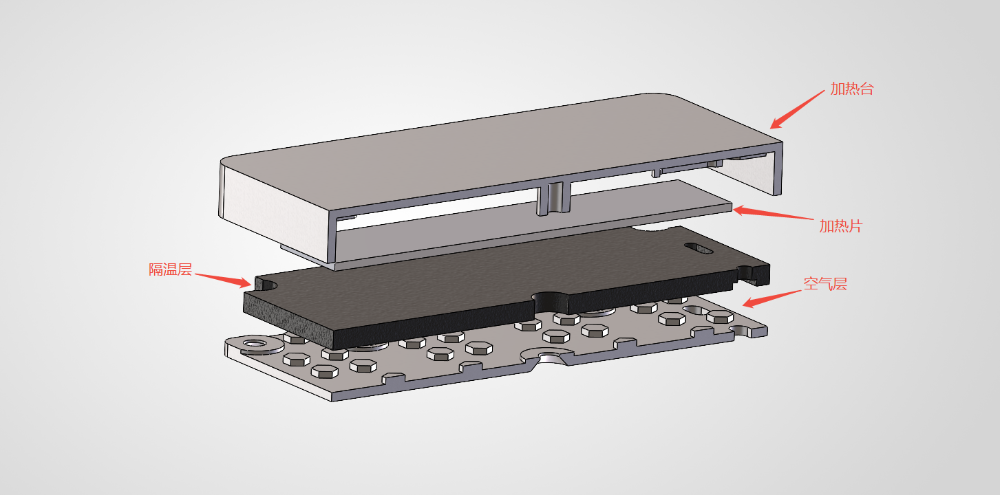
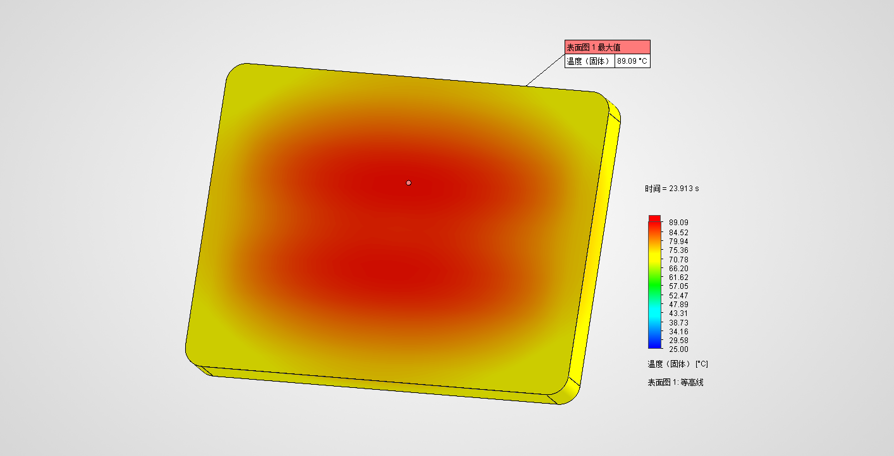

+++
author = "张小橙"
title = '一款小型加热台 HPlate-Mini'
date = '2026-09-21T15:55:13+08:00'
draft = false

[cover]
image = "/cover.png"
alt = "HPlate-Mini项目封面"
caption = ""
relative = false
hiddenInList = false
hiddenInSingle = true
+++

## 项目起源
现在焊接一直用鹿仙子铁板烧，最近有一次忘记关电源导致空载了好久有点后怕，所以想要换一台有控的，但是线上卖的小型加热台太贵了，所以本次项目就是用最少的成本制作一个精致小巧加热台。（打算用充电头供电100W这样子，做大了功率也不支持）

> ### 想要实现的炫酷吊炸天的效果
> - ~~交流电~~ ➡ 直流电
> - ~~通电加热~~ ➡ 闭环控温
> - ~~工业简陋风~~ ➡ 炫酷高级风
> - ~~力大砖飞~~ ➡ 极致的导温锁温
> - ~~毫无保护~~ ➡ 无懈可击

## 功能设计
### 那么现在赐予它一共洋气的英文名 HPlate ➡ Hot Plate直译：发热铁板
  

 
## 硬件开发 
- ### 加热单元
  平台使用了6061系铝合金 ``因为免费打样只支持这个材料``，热源使用两片7015陶瓷加热片 ``因为整块加热板需要开模太贵了``，使用云母片实现隔热和固定加热片，背板同样采用6061系铝合金，最后沉头螺丝压紧它们，经过层层优化和漫长的热力学仿，最终吧材料和功率都利用到极致，最终平台加热面积相比市售``50*50mm``加热台有效面积近乎翻倍工作面积提升近 ~~100%~~ 98.4% 说人话就是做到了``80*62mm`` 这个尺寸吧那肯定是跟免费打样限制80*80mm以内是没有关系的纯属巧合。。。。

    

    
    
加热台模块：内部结构

    

    

    
    
加热台模块：热力学仿真模型

    

    
    
