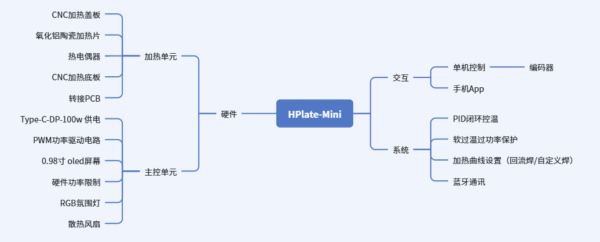

+++
author = "张小橙"
title = '一款小型加热台 HPlate-Mini'
date = '2026-09-21T15:55:13+08:00'
draft = false

[cover]
image = "/cover.png"
alt = "HPlate-Mini项目封面"
caption = ""
relative = false
hiddenInList = false
hiddenInSingle = true
+++

## 项目起源
之前焊接贴片一直用的鹿仙子，最近焊接变多了差点忘了关电源有点害怕，但是线上卖的小型加热台太贵了，所以本次项目就是用最少的成本制作一个加热台。

> ### 需要解决的严重隐患
> - ~~交流电~~ ➡ <mark>直流电</mark>
> - ~~通电加热~~ ➡ <mark>闭环控温</mark>

> ### 功能设计
  
