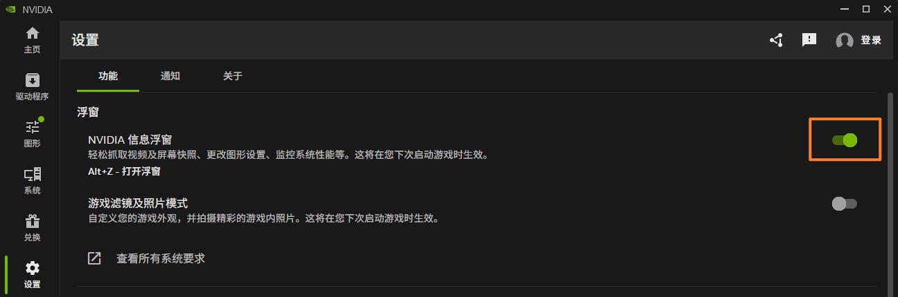
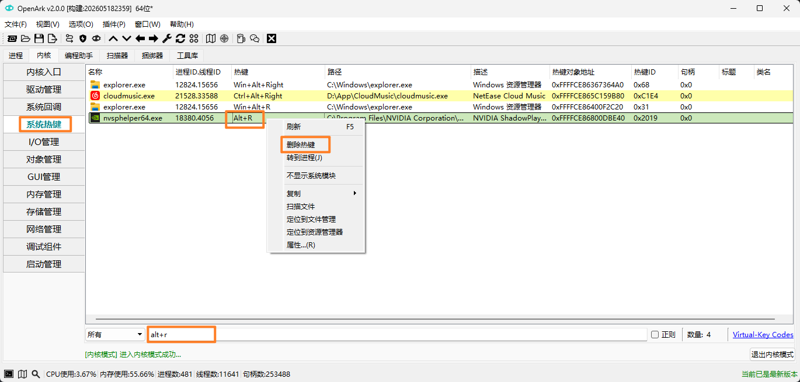

+++
author = "张小橙"
title = '嘉立创EDA快捷键Alt+R冲突问题'
date = '2026-09-21T15:55:13+08:00'
draft = false

[cover]
image = "/cover.png"
alt = "封面"
caption = ""
relative = false
hiddenInList = false
hiddenInSingle = true
+++

## 遇到的问题&解决方案
画原理图时发现【矩形快捷键 Alt+R】无法使用，排查后发现是 NVIDIA 驱动的信息浮窗占用了这个快捷键，直接在 NVIDIA 软件内关闭信息浮窗即可。
  
## 问题扩展
可能好奇的同学要问了，我怎么知道是这个软件产生的冲突，授人以鱼不如授人以渔，现在就分享给大家。
> **[OpenArk-软件官网链接](http://openark.blackint3.com:88/)**

  

打开软件后进入系统热键，搜索你要查询的快捷键，就可以找到占用应用，然后右键删除热键即可。
> ⚠️ **重要提示**
> 尽量在软件内部关闭热键。软件更新时有可能自动重置，再次注册抢占快捷键。

